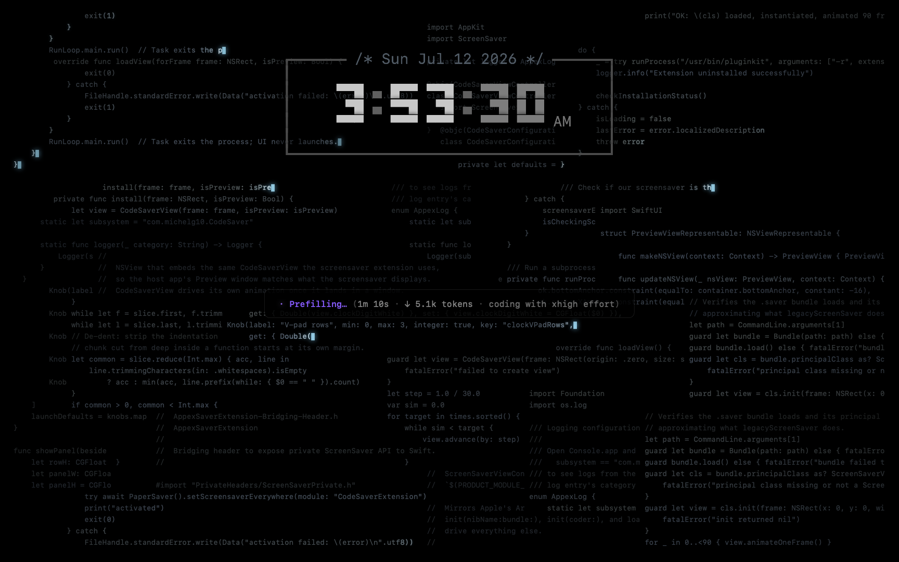

# CodeSaver — a Claude Code-inspired screensaver for the agentic coding era

Your Mac idles. The agent doesn't.



CodeSaver fills the screen with code sampled from your own GitHub repos, typed out live by a fleet of invisible coders in SF Mono, while a Claude Code-style spinner grinds away in the center:

```
✽ Sprokbooking… (2m 7s · ↓ 1.6k lines · still coding with xhigh effort)
```

## What it does

- **Background**: chunks of real code from your repos type in across the screen — glowing typing head, block cursor, whitespace skipped so the stream never stutters, settled lines dimming with age. Chunks place around loose band anchors with gaussian jitter, and new lines clip whatever they land on, terminal-style, so the layout never reads as a grid.
- **Spinner**: cycles verbs from a tab-delimited `Gerund<TAB>Past` list through a full request lifecycle — a latency window with just the glyph and glowing verb, then a streaming phase with elapsed time, an asymptotic line counter, ↓/↑ arrows with long-tailed dwell times (↑ = upload bursts: rarer, counter surges, typing speeds up), and a status that escalates `coding → still coding → almost done coding with xhigh effort` on a fixed clock each time it appears. Eventually:

  ```
  ✻ Sprokbooked for 2m 7s
  ```

  …flat grey, resting, background typing eased down to its slowest — then a new request begins.
- **Clock**: a TUI box in the spirit of Claude Code's welcome banner — heavy box-drawing rails with the date as a centered comment (`/* Sun Jul 12 2026 */`), the time in chunky `▀▄█` half-block digits with ticking seconds, and AM/PM on the digits' baseline. Toggleable (and switchable between 12/24-hour) from the **Options** sheet in System Settings; the spinner panel re-centers under whatever the clock occupies.
- The glyph ping-pongs through `· ✢ ✳ ✶ ✻ ✽`, the verb glows left-to-right, and the whole scene's tempo eases between states — everything on pure black, so OLED and miniLED displays render it borderless.

## Requirements

- macOS 14 (Sonoma) or later — the screensaver is a modern ExtensionKit `.appex`
- Xcode 15+
- An authenticated [`gh`](https://cli.github.com) CLI (for corpus ingestion)

## Build & install

```bash
./setup.sh                  # interactive: GitHub username, verbs list, signing team
./ingest.py                 # mirror source from your GitHub repos into ingest/cache/
./appex/install.sh          # sample a corpus, build, install to /Applications, register
```

Then pick **CodeSaver** in System Settings → Screen Saver. `open /Applications/CodeSaver.app` gives you a host app with install status and a live preview window.

`setup.sh` writes a gitignored `setup.conf` with your GitHub username (non-fork repos only; a manifest makes ingest re-runs incremental), your Apple team ID (auto-detected from your signing certificate when possible), and optionally the path to your own spinner-verbs list — tab-delimited lines of `Gerund<TAB>Past`. If you don't supply one, the bundled list is used.

`ingest.py` filters out non-source files (extension allowlist, size windows, `node_modules`-style dirs, generated-file patterns, bulk directories). `make_corpus.py` packs every cleaned file **whole** into `corpus.bin` with a repo-keyed byte index (`corpus-index.json`), deduplicating by content hash and dropping secret-looking lines. At runtime the saver memory-maps the corpus and draws a fresh ~400-file subset each launch — repos weighted by √(file count) with a per-repo share cap, so big projects dominate only within reason — decoding files lazily and refreshing half the subset every time a spinner "request" completes. **The corpus files are gitignored on purpose** — they embed your actual code, private repos included, and so does the built app.

## Repo layout

```
ingest.py                      stage 1: GitHub → ingest/cache/ (run occasionally)
make_corpus.py                 stage 2: cache → corpus.txt (runs at build)
appex/                         the screensaver (ExtensionKit appex + host app)
├── CodeSaverExtension/        the .appex — CodeSaverView.swift is the whole show
├── CodeSaver/                 SwiftUI host app (install / preview UI)
├── install.sh                 build + install to /Applications + pluginkit
└── BACKGROUND.md              appex screensaver architecture notes (upstream)
build.sh                       legacy .saver build + offscreen snapshot harness
Sources/PreviewMain.swift      windowed preview / PNG snapshot renderer
harness/loadtest.swift         bundle load smoke test
```

The snapshot harness is how the aesthetics were tuned: `./build.sh && ./build/preview --snapshot <dir> <t1> <t2>…` renders deterministic frames offscreen (`CODESAVER_WORKDUR` pins the cycle length).

## Tuning

Run `./build.sh && ./build/preview` for a live windowed preview with a floating **tuning panel**: sliders for the clock's geometry and brightness, the spinner panel's position, and the background code's alphas, fade rate, glow strength, and vignette — all applying live, all auto-saved to `build/clock-tuning.json` so chosen values can be promoted to the defaults in `CodeSaverView.swift`. (The preview view is drawn 33pt taller than the window, hanging off the top edge, so vertical positions match the menu-bar-less fullscreen saver; a "Reset to defaults" button restores the compiled values.)

Everything not on a slider lives as constants in `appex/CodeSaverExtension/CodeSaverView.swift`: the palette (`accent`, glow colors), typing speeds and newline cost in the writer logic, dwell/duration distributions in `startCycle`/`updateSpinner`, status escalation thresholds in `statusText(since:)`, and the glyph cadence in `workingString()`.

## Credits

- Appex scaffolding derived from [AppexSaverMinimal](https://github.com/AerialScreensaver/AppexSaverMinimal) by Guillaume Louel (MIT — see `appex/LICENSE`), whose reverse-engineering of the macOS appex screensaver format made this possible. `appex/BACKGROUND.md` is his write-up.
- Aesthetic homage to [Claude Code](https://claude.com/claude-code).

## License

[MIT](LICENSE). The appex scaffolding is derived from AppexSaverMinimal (MIT, Guillaume Louel — see `appex/LICENSE`).
